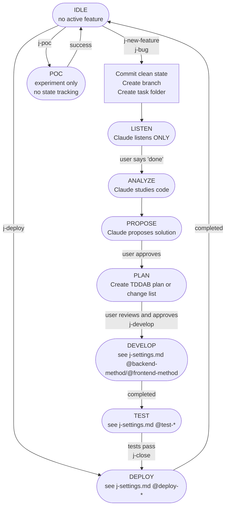

# Junior Workflow Mindset

## Purpose
This mindset guides Claude when working with junior/non-technical users.
It defines a strict workflow to prevent Claude from making mistakes or unauthorized changes.

---

## Prerequisites
**CRITICAL:** Before using ANY j-* command, ensure `j-settings.md` exists in project root.
If it doesn't exist, run `j-setup` first to configure the project.

---

## The Problem
- Claude makes mistakes without clear rules
- Junior users cannot follow or correct Claude
- After context compaction, Claude forgets important rules
- Need a "bulletproof" system to protect the codebase

---

## Workflow Algorithm



### State Tracking
State is saved in `activeContext.md`:
```
@state::LISTEN|ANALYZE|PROPOSE|PLAN|DEVELOP|TEST
@feature::NN-feature-name
@branch::feature/NN-feature-name
```

### Transversal Commands (from any state)
| Command | Action |
|---------|--------|
| `j-save` | Save state to MB, commit, push, leave |
| `j-status` | Read MB, show current state |
| `j-help` | Show available commands |
| `j-continue` | Read MB, resume from saved state |
| `j-setup` | Configure/update project settings |

---

## States Explained

### IDLE
- No feature in progress
- Branch: see `j-settings.md @main-branch`
- Valid commands: `j-new-feature`, `j-bug`, `j-deploy`, `j-poc`

### LISTEN
- User explains what they need
- Claude **DOES NOTHING** - only listens and records
- Transition: user says "done" or "finished"

### ANALYZE
- Claude reads code, uses ChromeDevTools, asks for screenshots
- Resources: code folder (see `j-settings.md @code`), docs folder (see `j-settings.md @docs`)
- Transition: Claude ready to propose

### PROPOSE
- Claude proposes solution
- Discussion, questions, clarifications
- Transition: user approves

### PLAN
- Backend: create plan per `j-settings.md @backend-method`
- Frontend: list of changes per `j-settings.md @frontend-method`
- User reviews and approves
- Transition: user approves plan, `j-develop`

### DEVELOP
- Execute according to `j-settings.md @backend-method` and `@frontend-method`
- **Update MB often!**
- Transition: development complete

### TEST
- Run tests per `j-settings.md @test-backend` and `@test-frontend`
- Check `j-settings.md @limitations` for what doesn't work locally
- Transition: tests pass

### DEPLOY
- Merge to main branch (see `j-settings.md @main-branch`)
- Run backup if configured (see `j-settings.md @backup-script`)
- Run deploy script (see `j-settings.md @deploy-script`)
- If deploy fails and restore configured → offer restore (see `j-settings.md @restore-script`)
- Verify at production domain (see `j-settings.md @domain`)
- Transition: back to IDLE

---

## Critical Rules - NEVER FORGET

### Reading Settings
**ALWAYS read `j-settings.md` at session start** for:
- Commands to run tests, builds, migrations
- Folder paths for code, tasks, docs
- Ports for local development
- Deploy configuration

### Database
- Check `j-settings.md @db-type` and `@db-local` for setup
- **IMPORTANT:** Migrations are ADDED, never recreated from scratch
- Use `j-settings.md @migrations-add` and `@migrations-apply` commands

### Deploy
- Script: see `j-settings.md @deploy-script`
- Documentation: see `j-settings.md @deploy-docs`
- Domain: see `j-settings.md @domain`

### Development Methodology
- Backend: follow `j-settings.md @backend-method` (tddab, tdd, or manual)
- Frontend: follow `j-settings.md @frontend-method` (chromedevtools, automated, or manual)
- TDDAB reference: see `j-settings.md @tddab-file`
- **Update MB often during development**

### Code Quality
- **ZERO warnings policy** - fix all warnings before closing feature
- If you see warnings during build → add them to TODO
- New code must not introduce new warnings
- When touching a file with existing warnings → fix them too

### Local Limitations
- Check `j-settings.md @limitations` for services that don't work locally

---

## Golden Rules

1. **NEVER act without being asked**
2. **ALWAYS read j-settings.md + MB at session start**
3. **ALWAYS ask before modifying code**
4. **Follow methodology from j-settings.md**
5. **Each feature = one branch**
6. **Migrations: ADD, never recreate**
7. **Update MB after every good checkpoint**
8. **NEVER delete branches** - push them, user needs control
9. **ALWAYS push branch before merge** - so user can review on remote
10. **ALWAYS use AskUserQuestion tool** - when you need more specs or clarification, use the tool instead of plain text questions
11. **REALITY WINS OVER MB** - if MB state doesn't match what you see (code, branches, folders), investigate and ask user before blindly following MB

---

## Resources (from j-settings.md)
- Code: `@code` folder
- Docs/POCs: `@docs` folder
- Tasks: `@tasks` folder
- Memory Bank: `memory-bank/`
- TDDAB reference: `@tddab-file`
